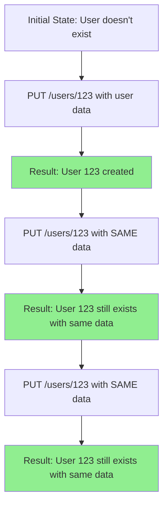
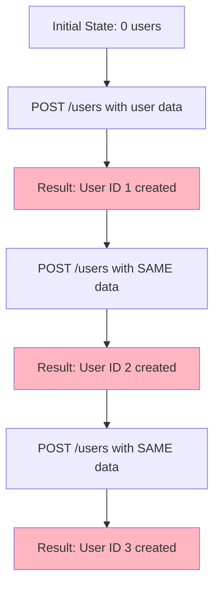
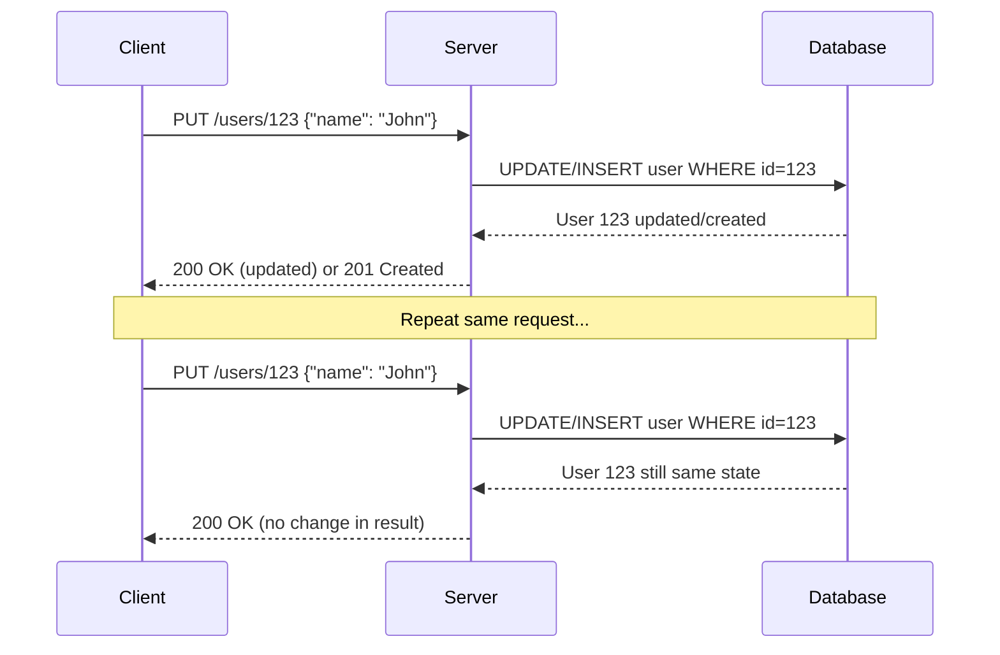
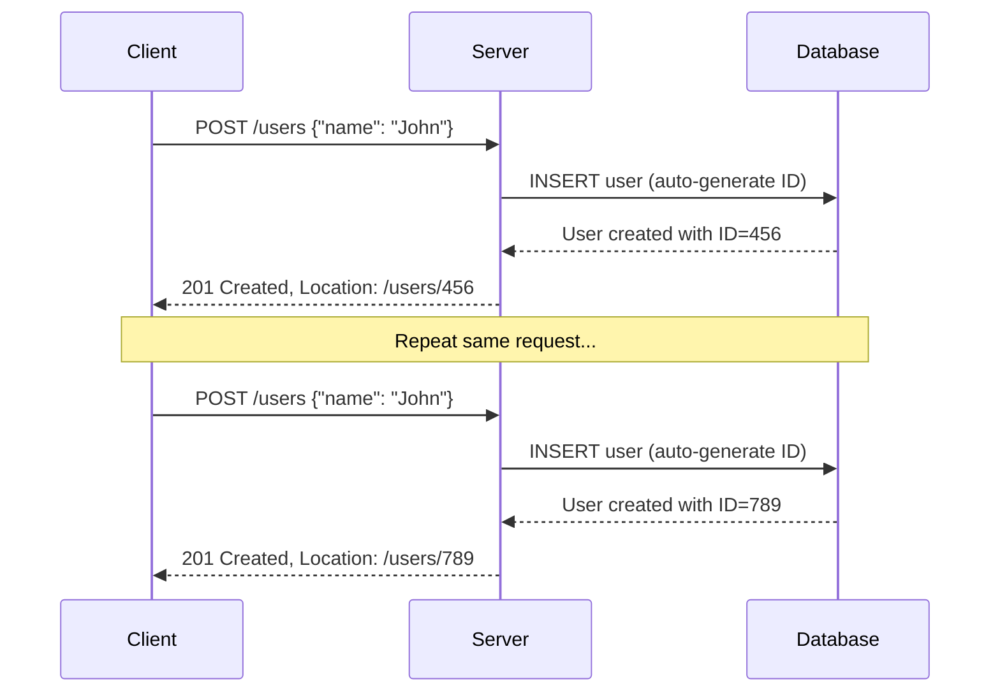

# 🔄 Idempotence in HTTP Methods - Deep Dive with Visual Learning

## 📚 **What is Idempotence?**

**Idempotence** means that making **multiple identical requests** has the **same effect** as making a **single request**. The result and side effects are identical, regardless of how many times you repeat the operation.

### **Mathematical Analogy**
```
f(f(x)) = f(x)
```
Applying the function multiple times gives the same result as applying it once.

---

## 🎨 **Visual Understanding with Diagrams**

### **Idempotent Operation Example (PUT)**


### **Non-Idempotent Operation Example (POST)**


---

## 🔍 **HTTP Methods Idempotence Matrix**

| Method | Idempotent | Safe | Example | Multiple Calls Effect |
|--------|------------|------|---------|----------------------|
| **GET** | ✅ Yes | ✅ Yes | `GET /users/123` | Same user data returned |
| **PUT** | ✅ Yes | ❌ No | `PUT /users/123` | Same user state achieved |
| **DELETE** | ✅ Yes | ❌ No | `DELETE /users/123` | User remains deleted |
| **POST** | ❌ No | ❌ No | `POST /users` | Multiple users created |
| **PATCH** | ❌ No | ❌ No | `PATCH /users/123` | Depends on implementation |
| **HEAD** | ✅ Yes | ✅ Yes | `HEAD /users/123` | Same headers returned |
| **OPTIONS** | ✅ Yes | ✅ Yes | `OPTIONS /users` | Same options returned |

---

## 🎯 **PUT vs POST - The Fundamental Difference**

### **PUT - "I know exactly where this goes"**


### **POST - "Server, please handle this for me"**


---

## 🧠 **Real-World Banking Examples**

### **Idempotent Banking Operations (Safe to Retry)**

#### **Account Balance Check (GET)**
```java
@GetMapping("/accounts/{accountId}/balance")
public ResponseEntity<Balance> getBalance(@PathVariable String accountId) {
    // Safe to call multiple times - no side effects
    Balance balance = accountService.getBalance(accountId);
    return ResponseEntity.ok(balance);
}
```

#### **Set Account Status (PUT)**
```java
@PutMapping("/accounts/{accountId}/status")
public ResponseEntity<Account> setAccountStatus(
    @PathVariable String accountId, 
    @RequestBody AccountStatus status) {
    
    // Idempotent - setting status to ACTIVE multiple times has same effect
    Account account = accountService.setStatus(accountId, status);
    return ResponseEntity.ok(account);
}
```

### **Non-Idempotent Banking Operations (Dangerous to Retry)**

#### **Money Transfer (POST)**
```java
@PostMapping("/transfers")
public ResponseEntity<Transfer> transferMoney(@RequestBody TransferRequest request) {
    // NON-IDEMPOTENT! Multiple calls = multiple transfers
    Transfer transfer = transferService.transfer(
        request.getFromAccount(), 
        request.getToAccount(), 
        request.getAmount()
    );
    return ResponseEntity.status(201).body(transfer);
}
```

---

## ⚠️ **Common Idempotence Mistakes**

### **❌ Mistake 1: Thinking DELETE is not idempotent**
```java
// WRONG THINKING:
// "DELETE returns 404 on second call, so it's not idempotent"

@DeleteMapping("/users/{id}")
public ResponseEntity<Void> deleteUser(@PathVariable Long id) {
    if (!userService.exists(id)) {
        return ResponseEntity.notFound().build(); // 404
    }
    userService.delete(id);
    return ResponseEntity.noContent().build(); // 204
}

// CORRECT UNDERSTANDING:
// Idempotence is about EFFECT, not response code
// Effect: User is deleted (same result regardless of how many calls)
```

### **❌ Mistake 2: Making PUT non-idempotent**
```java
// WRONG - This breaks idempotence:
@PutMapping("/users/{id}")
public ResponseEntity<User> updateUser(@PathVariable Long id, @RequestBody User user) {
    user.setLastModified(Instant.now()); // Changes on every call!
    user.setVersion(user.getVersion() + 1); // Increments on every call!
    // This is NOT idempotent anymore
}

// CORRECT - Idempotent PUT:
@PutMapping("/users/{id}")
public ResponseEntity<User> updateUser(@PathVariable Long id, @RequestBody User user) {
    user.setId(id); // Ensure ID matches
    // Only set timestamps if not provided by client
    User saved = userService.save(user);
    return ResponseEntity.ok(saved);
}
```

---

## 🎪 **Interactive Examples**

### **Scenario 1: E-commerce Order**
```bash
# Non-idempotent (Creates new order each time)
POST /orders
{
  "productId": "laptop-123",
  "quantity": 1,
  "customerId": "cust-456"
}

# Response 1: {"orderId": "order-001", "status": "created"}
# Response 2: {"orderId": "order-002", "status": "created"}  # NEW ORDER!
# Response 3: {"orderId": "order-003", "status": "created"}  # ANOTHER NEW ORDER!
```

```bash
# Idempotent (Updates specific order)
PUT /orders/order-001
{
  "status": "cancelled",
  "cancellationReason": "customer request"
}

# Response 1: {"orderId": "order-001", "status": "cancelled"}
# Response 2: {"orderId": "order-001", "status": "cancelled"}  # SAME STATE
# Response 3: {"orderId": "order-001", "status": "cancelled"}  # SAME STATE
```

### **Scenario 2: User Profile Picture**
```bash
# Idempotent (Replaces profile picture)
PUT /users/123/profile-picture
Content-Type: image/jpeg
[binary image data]

# Result 1: Profile picture updated
# Result 2: Same profile picture (no change)
# Result 3: Same profile picture (no change)
```

```bash
# Non-idempotent (Adds to photo gallery)
POST /users/123/photos
Content-Type: image/jpeg
[binary image data]

# Result 1: Photo added to gallery (photo-001)
# Result 2: Same photo added again (photo-002)
# Result 3: Same photo added again (photo-003)
```

---

## 🔧 **Testing Idempotence**

### **Spring Boot Test Example**
```java
@Test
public void testPutIdempotence() {
    // Given
    User user = new User("John", "john@example.com");
    
    // When - Make same PUT request multiple times
    ResponseEntity<User> response1 = restTemplate.exchange(
        "/users/123", HttpMethod.PUT, 
        new HttpEntity<>(user), User.class);
    
    ResponseEntity<User> response2 = restTemplate.exchange(
        "/users/123", HttpMethod.PUT, 
        new HttpEntity<>(user), User.class);
    
    ResponseEntity<User> response3 = restTemplate.exchange(
        "/users/123", HttpMethod.PUT, 
        new HttpEntity<>(user), User.class);
    
    // Then - All responses should have same effect
    assertThat(response1.getBody()).isEqualTo(response2.getBody());
    assertThat(response2.getBody()).isEqualTo(response3.getBody());
    
    // Verify database state is consistent
    User savedUser = userRepository.findById(123L).orElse(null);
    assertThat(savedUser.getName()).isEqualTo("John");
    assertThat(savedUser.getEmail()).isEqualTo("john@example.com");
}
```

---

## 🎯 **Key Takeaways for Interviews**

### **Remember These Points:**
1. **Idempotence = Same Effect, Not Same Response Code**
2. **PUT is idempotent because you specify the exact resource location**
3. **POST is not idempotent because server determines resource creation**
4. **DELETE is idempotent because "delete this resource" always achieves the same end state**
5. **GET is both idempotent and safe (no side effects)**

### **Quick Mental Model:**
- **PUT**: "Set this resource to this exact state" (idempotent)
- **POST**: "Process this data" (not idempotent)
- **DELETE**: "Remove this resource" (idempotent)
- **GET**: "Show me this resource" (idempotent + safe)

### **Banking Context:**
- **Account balance inquiry**: GET (safe + idempotent)
- **Set account limit**: PUT (idempotent)
- **Process transaction**: POST (not idempotent - very important!)
- **Close account**: DELETE (idempotent)

**💡 Remember: In banking, idempotence is crucial for preventing duplicate transactions and ensuring system reliability!**