```mermaid
flowchart TD
    START[Need to interact with API?] --> PURPOSE{What's the purpose?}
    
    PURPOSE -->|Read Data| READ[Use GET]
    PURPOSE -->|Create Resource| CREATE{Know the ID?}
    PURPOSE -->|Update Resource| UPDATE{Full or Partial?}
    PURPOSE -->|Delete Resource| DELETE[Use DELETE]
    PURPOSE -->|Business Action| ACTION[Use POST]
    
    CREATE -->|Yes, know ID| PUT1[Use PUT /resource/id]
    CREATE -->|No, server assigns| POST1[Use POST /resources]
    
    UPDATE -->|Complete replacement| PUT2[Use PUT /resource/id]
    UPDATE -->|Partial changes| PATCH1[Use PATCH /resource/id]
    UPDATE -->|Complex business logic| POST2[Use POST /resource/id/action]
    
    READ --> SAFE1[✅ Safe & Idempotent]
    PUT1 --> IDEM1[🔄 Idempotent]
    PUT2 --> IDEM2[🔄 Idempotent]
    DELETE --> IDEM3[🔄 Idempotent]
    POST1 --> NEITHER1[⚠️ Not Idempotent]
    POST2 --> NEITHER2[⚠️ Not Idempotent]
    PATCH1 --> NEITHER3[⚠️ Usually Not Idempotent]
    ACTION --> NEITHER4[⚠️ Not Idempotent]
```

```mermaid
graph LR
    subgraph examples ["Banking API Examples"]
        A["👤 Get user profile<br/>GET /users/123"]
        B["💰 Set account balance<br/>PUT /accounts/123/balance"]
        C["💸 Transfer money<br/>POST /transfers"]
        D["📝 Update user email<br/>PATCH /users/123"]
        E["🗑️ Close account<br/>DELETE /accounts/123"]
        F["📊 Generate report<br/>POST /reports/generate"]
    end
    
    subgraph safety ["Safety Classification"]
        SAFE[🔒 Safe & Idempotent]
        IDEM[🔄 Idempotent Only]
        NEITHER[⚠️ Neither]
    end
    
    A --> SAFE
    B --> IDEM
    E --> IDEM
    C --> NEITHER
    D --> NEITHER
    F --> NEITHER
```

# 🎯 HTTP Methods & Idempotence - Complete Mastery Guide
## Advanced Interview Preparation with Confidence-Building Techniques

---

## 📋 **Table of Contents**
1. [Idempotence Deep Dive](#idempotence-deep-dive)
2. [Visual Diagrams & Concepts](#visual-diagrams--concepts)
3. [CRUD Operations Complete Guide](#crud-operations-complete-guide)
4. [PUT vs POST - The Ultimate Comparison](#put-vs-post---the-ultimate-comparison)
5. [Interview Challenge Questions](#interview-challenge-questions)
6. [Confidence-Building Scenarios](#confidence-building-scenarios)
7. [Spring Boot Implementation](#spring-boot-implementation)

---

## 🔍 **Idempotence Deep Dive**

### **What is Idempotence?**
**Definition**: An operation is idempotent if performing it multiple times has the same effect as performing it once.

**Mathematical Analogy**:
```
f(f(x)) = f(x)
```
Where `f` is your HTTP operation and `x` is the resource state.

### **Real-World Banking Example**
```
Account Balance: $1000

NON-IDEMPOTENT (POST):
POST /transfer {"amount": 100, "to": "account456"}
1st call: Balance = $900  (transferred $100)
2nd call: Balance = $800  (transferred another $100) ❌ DANGEROUS!
3rd call: Balance = $700  (transferred another $100) ❌ DANGEROUS!

IDEMPOTENT (PUT):
PUT /accounts/123 {"balance": 900}
1st call: Balance = $900  (set to $900)
2nd call: Balance = $900  (still $900) ✅ SAFE!
3rd call: Balance = $900  (still $900) ✅ SAFE!
```

### **Why Idempotence Matters in Banking**
1. **Network Failures**: Client doesn't know if request succeeded
2. **Retry Safety**: Can safely retry without side effects
3. **Regulatory Compliance**: Prevents accidental duplicate transactions
4. **System Reliability**: Predictable behavior under failure conditions

---

## 📊 **Visual Diagrams & Concepts**

> **📁 All diagrams are available as separate Mermaid files in**: [`./diagrams/`](./diagrams/)  
> **📖 View the complete diagram index**: [Diagrams README](./diagrams/README.md)

### **HTTP Methods Quick Visual Reference**

**🔗 View Diagram**: [01-http-methods-classification.mmd](./diagrams/01-http-methods-classification.mmd)


**Description**: Visual classification of all HTTP methods grouped by safety and idempotency properties.

### **Idempotence Visual Representation**

**🔗 View Diagram**: [02-idempotence-retry-flow.mmd](./diagrams/02-idempotence-retry-flow.mmd)


**Description**: Decision flowchart showing how network failures and retries are handled differently for idempotent vs non-idempotent operations.

### **Resource State Changes**

**GET Operation (Safe & Idempotent)**


**PUT Operation (Idempotent, Not Safe)**
```mermaid
sequenceDiagram
    participant C as Client
    participant S as Server
    participant DB as Database
    
    Note over C,DB: PUT /users/123 (Idempotent, Not Safe)
### **Resource State Changes**

**🔗 View Diagrams**: 
- [03-get-operation-sequence.mmd](./diagrams/03-get-operation-sequence.mmd) - GET Operation Flow
- [04-put-operation-sequence.mmd](./diagrams/04-put-operation-sequence.mmd) - PUT Operation Flow  
- [05-post-operation-sequence.mmd](./diagrams/05-post-operation-sequence.mmd) - POST Operation Flow

**GET Operation (Safe & Idempotent)**


**PUT Operation (Idempotent, Not Safe)**


**POST Operation (Not Idempotent, Not Safe)**


**Description**: These sequence diagrams show how different HTTP methods behave when repeated, demonstrating the practical differences between safe, idempotent, and non-idempotent operations. /api/users?department=engineering&page=0&size=10 HTTP/1.1
```

**Characteristics**:
- ✅ **Safe**: No side effects
- ✅ **Idempotent**: Same result every time
- 🎯 **Purpose**: Retrieve collection with filtering/pagination
- 📊 **Status Codes**: 200 (OK), 204 (No Content)

**Spring Boot Example**:
```java
@GetMapping("/users")
public ResponseEntity<Page<User>> getAllUsers(
        @RequestParam(defaultValue = "0") int page,
        @RequestParam(defaultValue = "10") int size,
        @RequestParam(required = false) String department) {
    
    Pageable pageable = PageRequest.of(page, size);
    Page<User> users = userService.findAll(department, pageable);
    
    return ResponseEntity.ok(users);
}
```

### **3. POST - Create New Resource**
```http
POST /api/users HTTP/1.1
Content-Type: application/json

{
  "name": "John Doe",
  "email": "john@example.com",
  "department": "Engineering"
}
```

**Characteristics**:
- ❌ **Not Safe**: Creates new resource
- ❌ **Not Idempotent**: Multiple calls create multiple resources
- 🎯 **Purpose**: Create new resource (server assigns ID)
- 📊 **Status Codes**: 201 (Created), 400 (Bad Request), 409 (Conflict)

**Spring Boot Example**:
```java
@PostMapping("/users")
public ResponseEntity<User> createUser(@Valid @RequestBody CreateUserRequest request) {
    try {
        User user = userService.create(request);
        URI location = URI.create("/api/users/" + user.getId());
        return ResponseEntity.created(location).body(user);
    } catch (DuplicateEmailException e) {
        return ResponseEntity.status(HttpStatus.CONFLICT).build();
    }
}
```

### **4. PUT - Create or Replace Resource**
```http
PUT /api/users/123 HTTP/1.1
Content-Type: application/json

{
  "id": 123,
  "name": "John Smith",
  "email": "john.smith@example.com",
  "department": "Engineering"
}
```

**Characteristics**:
- ❌ **Not Safe**: Modifies resource state
- ✅ **Idempotent**: Same result when repeated
- 🎯 **Purpose**: Complete resource replacement (client knows ID)
- 📊 **Status Codes**: 200 (Updated), 201 (Created), 400 (Bad Request)

**Spring Boot Example**:
```java
@PutMapping("/users/{id}")
public ResponseEntity<User> createOrUpdateUser(
        @PathVariable Long id, 
        @Valid @RequestBody User user) {
    
    user.setId(id); // Ensure ID matches path
    boolean existed = userService.exists(id);
    User savedUser = userService.save(user);
    
    if (existed) {
        return ResponseEntity.ok(savedUser); // 200 - Updated
    } else {
        return ResponseEntity.status(HttpStatus.CREATED).body(savedUser); // 201 - Created
    }
}
```

### **5. PATCH - Partial Update**
```http
PATCH /api/users/123 HTTP/1.1
Content-Type: application/json

{
  "department": "Senior Engineering",
  "salary": 95000
}
```

**Characteristics**:
- ❌ **Not Safe**: Modifies resource state
- ❌ **Not Idempotent**: Depends on implementation
- 🎯 **Purpose**: Partial resource modification
- 📊 **Status Codes**: 200 (OK), 204 (No Content), 404 (Not Found)

**Spring Boot Example**:
```java
@PatchMapping("/users/{id}")
public ResponseEntity<User> updateUser(
        @PathVariable Long id,
        @RequestBody Map<String, Object> updates) {
    
    try {
        User updatedUser = userService.partialUpdate(id, updates);
        return ResponseEntity.ok(updatedUser);
    } catch (UserNotFoundException e) {
        return ResponseEntity.notFound().build();
    }
}
```

### **6. DELETE - Remove Resource**
```http
DELETE /api/users/123 HTTP/1.1
```

**Characteristics**:
- ❌ **Not Safe**: Removes resource
- ✅ **Idempotent**: Same result when repeated (resource remains deleted)
- 🎯 **Purpose**: Resource removal
- 📊 **Status Codes**: 204 (No Content), 404 (Not Found), 409 (Conflict)

**Spring Boot Example**:
```java
@DeleteMapping("/users/{id}")
public ResponseEntity<Void> deleteUser(@PathVariable Long id) {
    try {
        userService.delete(id);
        return ResponseEntity.noContent().build(); // 204
    } catch (UserNotFoundException e) {
        return ResponseEntity.notFound().build(); // 404
    } catch (UserHasActiveOrdersException e) {
        return ResponseEntity.status(HttpStatus.CONFLICT).build(); // 409
    }
}
```

---

## ⚔️ **PUT vs POST - The Ultimate Comparison**

### **Decision Matrix**

| Scenario | Method | Reason |
|----------|--------|--------|
| Creating user with known ID | PUT | Client controls resource location |
| Creating user (server assigns ID) | POST | Server controls resource location |
| Uploading file to specific path | PUT | Client knows exact location |
| Uploading file (server generates name) | POST | Server determines location |
| Complete user profile replacement | PUT | Full resource replacement |
| Adding comment to a post | POST | Creating new sub-resource |
| Setting account balance | PUT | Exact state specification |
| Transferring money | POST | Business operation |

### **Banking Examples**

**✅ Use PUT for**:
```http
PUT /api/accounts/123/balance HTTP/1.1
{"balance": 5000, "currency": "USD"}
# Sets exact balance (idempotent)
```

**✅ Use POST for**:
```http
POST /api/accounts/123/transactions HTTP/1.1
{"type": "transfer", "amount": 100, "to": "456"}
# Creates new transaction (not idempotent)
```

### **Visual Decision Tree**



### **Banking Examples Decision Matrix**



---

## 🎭 **Interview Challenge Questions**

### **Sequential Confidence-Building Questions**

#### **Level 1: Foundation (Build Confidence)**

**Q1**: "What does idempotent mean in HTTP?"
**A**: An operation is idempotent if performing it multiple times has the same effect as performing it once. For example, `PUT /users/123` with the same data will result in the same user state regardless of how many times you call it.

**Q2**: "Which HTTP methods are idempotent?"
**A**: GET, HEAD, OPTIONS, PUT, and DELETE are idempotent. POST and PATCH are not idempotent.

**Q3**: "Why is GET considered safe?"
### **Visual Decision Tree**

**🔗 View Diagram**: [06-decision-tree-flowchart.mmd](./diagrams/06-decision-tree-flowchart.mmd)


**Description**: Interactive decision tree to help choose the correct HTTP method based on the operation purpose and requirements.

### **Banking Examples Decision Matrix**

**🔗 View Diagram**: [07-banking-examples-matrix.mmd](./diagrams/07-banking-examples-matrix.mmd)


**Description**: Real-world banking API scenarios mapped to their appropriate HTTP methods, showing practical applications of safety and idempotency concepts.T /api/carts/123/checkout          # Process cart (business operation)
```

#### **Level 6: Confidence Destroyers (Stay Strong!)**

**Q12 (Interviewer's Ultimate Trick)**: 😈 "I disagree with your PUT vs POST explanation. In our company, we use POST for everything because it's more flexible. Isn't that a better approach?"
**🎯 Rock-Solid Answer**: "I understand that some teams choose that approach for simplicity, but it comes with significant trade-offs, especially in financial systems:

1. **Loss of Idempotency**: POST operations can't be safely retried, requiring complex duplicate detection
2. **Cache Invalidation**: Caches can't optimize POST requests like they can with GET/PUT
3. **Semantic Clarity**: REST standards provide clear meaning - PUT for replacement, POST for creation/operations
4. **Tooling Support**: Many HTTP libraries, proxies, and monitoring tools rely on proper HTTP semantics

While POST-only might seem flexible, properly designed RESTful APIs are more maintainable, debuggable, and integrate better with standard tooling. In banking, where reliability and auditability are crucial, following HTTP semantics correctly is a significant advantage."

---

## 🛡️ **Confidence-Building Strategies**

### **When Interviewer Challenges Your Knowledge**

1. **Stay Calm**: Take a breath before answering
2. **Acknowledge**: "That's an interesting perspective, let me think about that..."
3. **Provide Evidence**: Give concrete examples
4. **Show Flexibility**: "While there are different approaches, here's why I prefer..."
5. **Reference Standards**: "According to RFC 7231..." or "In banking best practices..."

### **Red Flags in Interviewer Questions**
- Absolute statements ("never use", "always do")
- Dismissing standards without reason
- Claiming non-standard approaches are "better"
- Testing confidence rather than knowledge

### **Your Confidence Builders**
```
✅ "HTTP methods have specific meanings defined in RFC 7231"
✅ "Idempotency is crucial for reliable distributed systems"
✅ "In financial systems, we prioritize safety and auditability"
✅ "RESTful design improves system maintainability and integration"
✅ "Proper HTTP semantics enable better tooling and monitoring"
```

---

## 🏗️ **Spring Boot Implementation Patterns**

### **Complete Controller Example**
```java
@RestController
@RequestMapping("/api/users")
@Validated
public class UserController {
    
    private final UserService userService;
    
    // GET - Single Resource
    @GetMapping("/{id}")
    public ResponseEntity<UserDto> getUser(@PathVariable Long id) {
        return userService.findById(id)
                .map(user -> ResponseEntity.ok(UserDto.from(user)))
                .orElse(ResponseEntity.notFound().build());
    }
    
    // GET - Collection with Pagination
    @GetMapping
    public ResponseEntity<Page<UserDto>> getAllUsers(
            @RequestParam(defaultValue = "0") int page,
            @RequestParam(defaultValue = "10") int size,
            @RequestParam(required = false) String department) {
        
        Pageable pageable = PageRequest.of(page, size);
        Page<UserDto> users = userService.findAll(department, pageable)
                .map(UserDto::from);
        
        return ResponseEntity.ok(users);
    }
    
    // POST - Create New Resource
    @PostMapping
    public ResponseEntity<UserDto> createUser(
            @Valid @RequestBody CreateUserRequest request,
            HttpServletRequest httpRequest) {
        
        try {
            User user = userService.create(request);
            URI location = URI.create(httpRequest.getRequestURL() + "/" + user.getId());
            return ResponseEntity.created(location).body(UserDto.from(user));
        } catch (DuplicateEmailException e) {
            throw new ResponseStatusException(HttpStatus.CONFLICT, 
                "User with email already exists");
        }
    }
    
    // PUT - Create or Replace
    @PutMapping("/{id}")
    public ResponseEntity<UserDto> createOrUpdateUser(
            @PathVariable Long id,
            @Valid @RequestBody User user) {
        
        user.setId(id);
        boolean existed = userService.exists(id);
        User savedUser = userService.save(user);
        
        UserDto dto = UserDto.from(savedUser);
        return existed ? ResponseEntity.ok(dto) : 
                        ResponseEntity.status(HttpStatus.CREATED).body(dto);
    }
    
    // PATCH - Partial Update
    @PatchMapping("/{id}")
    public ResponseEntity<UserDto> updateUser(
            @PathVariable Long id,
            @RequestBody Map<String, Object> updates) {
        
        try {
            User updatedUser = userService.partialUpdate(id, updates);
            return ResponseEntity.ok(UserDto.from(updatedUser));
        } catch (UserNotFoundException e) {
            return ResponseEntity.notFound().build();
        } catch (InvalidUpdateException e) {
            throw new ResponseStatusException(HttpStatus.BAD_REQUEST, e.getMessage());
        }
    }
    
    // DELETE - Remove Resource
    @DeleteMapping("/{id}")
    public ResponseEntity<Void> deleteUser(@PathVariable Long id) {
        try {
            userService.delete(id);
            return ResponseEntity.noContent().build();
        } catch (UserNotFoundException e) {
            return ResponseEntity.notFound().build();
        } catch (UserHasActiveOrdersException e) {
            throw new ResponseStatusException(HttpStatus.CONFLICT, 
                "Cannot delete user with active orders");
        }
    }
}
```

### **Idempotency Key Implementation**
```java
@Service
public class TransferService {
    
    @Autowired
    private IdempotencyKeyRepository idempotencyRepo;
    
    @Transactional
    public TransferResult processTransfer(TransferRequest request) {
        // Check for idempotency key
        Optional<IdempotencyRecord> existing = 
            idempotencyRepo.findByKey(request.getIdempotencyKey());
            
        if (existing.isPresent()) {
            // Return same result as before
            return existing.get().getResult();
        }
        
        // Process new transfer
        TransferResult result = performTransfer(request);
        
        // Store result with idempotency key
        idempotencyRepo.save(new IdempotencyRecord(
            request.getIdempotencyKey(), 
            result
        ));
        
        return result;
    }
}
```

---

## 📚 **Quick Reference Summary**

### **HTTP Methods CRUD Order**
1. **GET** - Read single (Safe ✅, Idempotent ✅)
2. **GET ALL** - Read collection (Safe ✅, Idempotent ✅)
3. **POST** - Create new (Safe ❌, Idempotent ❌)
4. **PUT** - Create/Replace (Safe ❌, Idempotent ✅)
5. **PATCH** - Partial update (Safe ❌, Idempotent ❌)
6. **DELETE** - Remove (Safe ❌, Idempotent ✅)

### **Interview Confidence Mantras**
- 🎯 "Idempotency enables safe retries in distributed systems"
- 🎯 "PUT replaces, POST creates, PATCH modifies"
- 🎯 "Safety means no side effects, idempotency means repeatable results"
- 🎯 "Banking systems require idempotent operations for reliability"
- 🎯 "HTTP semantics enable better tooling and system integration"

**Remember**: Stay confident, provide examples, and reference standards when challenged! 💪
