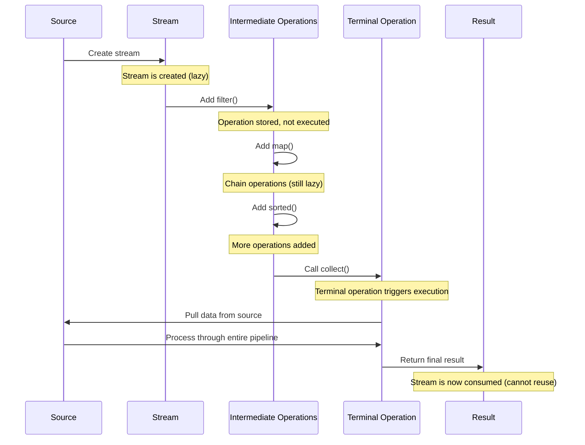
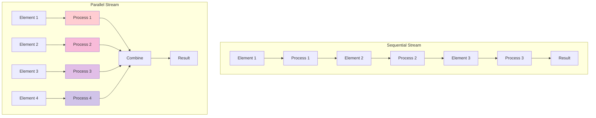
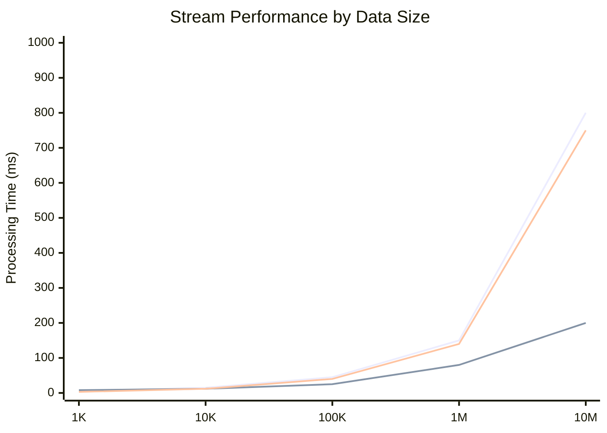
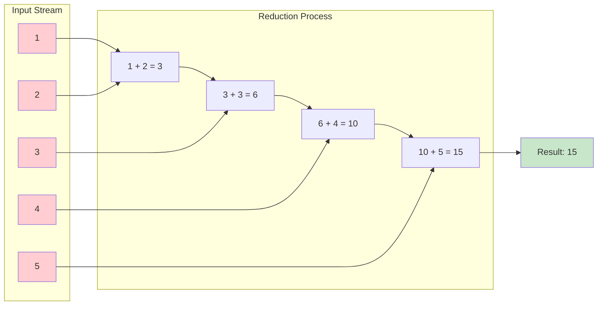
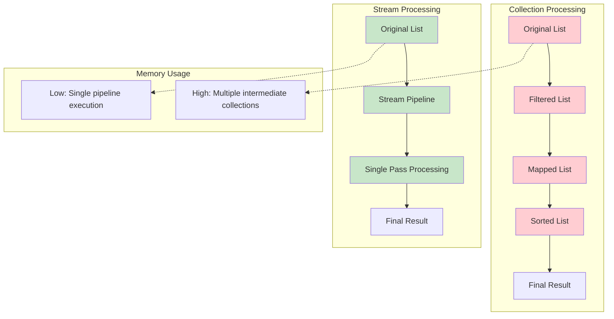

# Java Streams API - Visual Diagrams

## 🎯 **Stream Processing Pipeline**

```mermaid
graph LR
    A[Data Source] --> B[Stream Creation]
    B --> C[Intermediate Operations]
    C --> D[Terminal Operation]
    D --> E[Result]
    
    subgraph "Intermediate Operations (Lazy)"
        C1[filter()]
        C2[map()]
        C3[sorted()]
        C4[distinct()]
    end
    
    subgraph "Terminal Operations (Eager)"
        D1[collect()]
        D2[forEach()]
        D3[reduce()]
        D4[count()]
    end
    
    C --> C1
    C1 --> C2
    C2 --> C3
    C3 --> C4
    C4 --> D1
    
    style A fill:#e1f5fe
    style E fill:#c8e6c9
    style C fill:#fff3e0
    style D fill:#ffebee
```

## 🔄 **Stream Lifecycle**



## 📊 **Operations Classification**

```mermaid
mindmap
  root((Stream Operations))
    Intermediate
      Stateless
        filter()
        map()
        flatMap()
        peek()
      Stateful
        sorted()
        distinct()
        limit()
        skip()
    Terminal
      Non-short-circuiting
        forEach()
        collect()
        reduce()
        count()
      Short-circuiting
        anyMatch()
        allMatch()
        findFirst()
        findAny()
```

## 🎭 **Parallel vs Sequential Processing**



## 🗂️ **Collectors Hierarchy**

```mermaid
graph TD
    A[Collectors] --> B[Simple Collectors]
    A --> C[Grouping Collectors]
    A --> D[Reduction Collectors]
    A --> E[Partitioning Collectors]
    
    B --> B1[toList()]
    B --> B2[toSet()]
    B --> B3[toMap()]
    B --> B4[joining()]
    
    C --> C1[groupingBy()]
    C --> C2[groupingBy() + downstream]
    C --> C3[Multi-level grouping]
    
    D --> D1[counting()]
    D --> D2[summingInt()]
    D --> D3[averagingDouble()]
    D --> D4[summarizingInt()]
    
    E --> E1[partitioningBy()]
    E --> E2[partitioningBy() + downstream]
    
    style A fill:#e3f2fd
    style B fill:#fff3e0
    style C fill:#f3e5f5
    style D fill:#e8f5e8
    style E fill:#fce4ec
```

## 🎯 **Stream Creation Methods**

```mermaid
flowchart LR
    subgraph Sources
        A[Collection]
        B[Array]
        C[Generator]
        D[Builder]
        E[Files]
    end
    
    subgraph "Stream Creation"
        F[collection.stream()]
        G[Arrays.stream()]
        H[Stream.generate()]
        I[Stream.builder()]
        J[Files.lines()]
    end
    
    subgraph "Stream Types"
        K[Stream&lt;T&gt;]
        L[IntStream]
        M[LongStream]
        N[DoubleStream]
    end
    
    A --> F
    B --> G
    C --> H
    D --> I
    E --> J
    
    F --> K
    G --> K
    H --> K
    I --> K
    J --> K
    
    G --> L
    G --> M
    G --> N
    
    style Sources fill:#e1f5fe
    style K fill:#c8e6c9
    style L fill:#ffcdd2
    style M fill:#ffcdd2
    style N fill:#ffcdd2
```

## 🔄 **FlatMap Visualization**

```mermaid
graph TD
    subgraph "Input: Stream of Lists"
        A1["[1, 2, 3]"]
        A2["[4, 5]"]
        A3["[6, 7, 8, 9]"]
    end
    
    subgraph "map() would give"
        B1["[[1, 2, 3], [4, 5], [6, 7, 8, 9]]"]
    end
    
    subgraph "flatMap() gives"
        C1[1]
        C2[2]
        C3[3]
        C4[4]
        C5[5]
        C6[6]
        C7[7]
        C8[8]
        C9[9]
    end
    
    A1 -.->|map()| B1
    A2 -.->|map()| B1
    A3 -.->|map()| B1
    
    A1 -->|flatMap()| C1
    A1 -->|flatMap()| C2
    A1 -->|flatMap()| C3
    A2 -->|flatMap()| C4
    A2 -->|flatMap()| C5
    A3 -->|flatMap()| C6
    A3 -->|flatMap()| C7
    A3 -->|flatMap()| C8
    A3 -->|flatMap()| C9
    
    style B1 fill:#ffcdd2
    style C1 fill:#c8e6c9
    style C2 fill:#c8e6c9
    style C3 fill:#c8e6c9
    style C4 fill:#c8e6c9
    style C5 fill:#c8e6c9
    style C6 fill:#c8e6c9
    style C7 fill:#c8e6c9
    style C8 fill:#c8e6c9
    style C9 fill:#c8e6c9
```

## 📈 **Performance Comparison**



## 🎪 **Grouping Operations Flow**

```mermaid
graph LR
    A[Stream of Employees] --> B[groupingBy department]
    B --> C{Department Groups}
    
    C --> D[Engineering: List&lt;Employee&gt;]
    C --> E[Marketing: List&lt;Employee&gt;]
    C --> F[HR: List&lt;Employee&gt;]
    
    subgraph "With Downstream Collector"
        G[groupingBy + counting()] --> H[Engineering: 4]
        G --> I[Marketing: 2]
        G --> J[HR: 2]
    end
    
    subgraph "Multi-level Grouping"
        K[groupingBy dept, then by level] --> L[Engineering: {Senior: 2, Junior: 2}]
        K --> M[Marketing: {Senior: 1, Junior: 1}]
    end
    
    style A fill:#e1f5fe
    style C fill:#fff3e0
    style D fill:#c8e6c9
    style E fill:#c8e6c9
    style F fill:#c8e6c9
```

## 🔧 **Reduce Operation Visualization**



## 💡 **Memory Usage: Stream vs Collection**



---

## 🎯 **Quick Visual References**

### **Stream States**
- 🟢 **Active**: Stream created, ready for operations
- 🟡 **Processing**: Terminal operation executing
- 🔴 **Consumed**: Stream used, cannot be reused

### **Operation Types**
- 🔄 **Intermediate**: Lazy, returns new stream
- ⏹️ **Terminal**: Eager, produces result, consumes stream

### **Performance Indicators**
- 🚀 **Fast**: Simple operations, small datasets
- ⚡ **Parallel Candidate**: Large datasets, CPU-intensive
- 🐌 **Avoid**: Small datasets with parallel streams

---

**💡 Pro Tip**: Use these diagrams to explain stream concepts in interviews! Visual explanations demonstrate deep understanding. 🎯